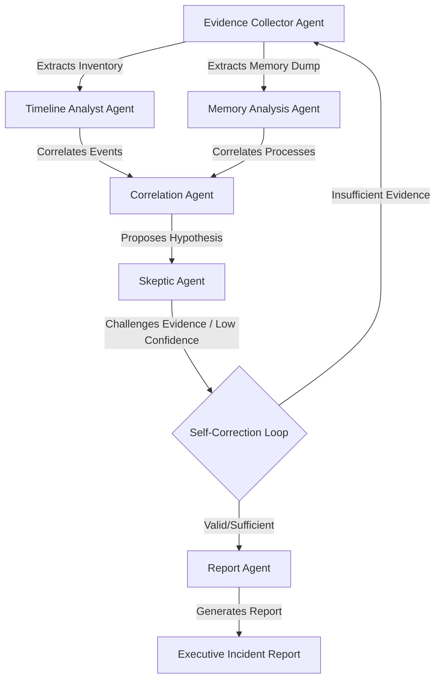

# SentinelMind DFIR

**SentinelMind DFIR** is a self-correcting, autonomous incident response platform built on top of the SANS SIFT Workstation. It utilizes a multi-agent orchestration architecture to ingest, analyze, correlate, and skeptically challenge forensic evidence, ensuring write protection and immutable audit trails.

---

## 🏗️ Core Architecture & Workflow

SentinelMind operates using a senior-incident-responder workflow divided among **6 specialized AI agents**:



1.  **Evidence Collector Agent**: Mounts disk images, extracts filesystem metadata, and tracks read-only evidence file hashes.
2.  **Memory Analysis Agent**: Scans memory captures (`pslist`, `netscan`, `yarascan`) to detect rogue processes and C2 channels.
3.  **Timeline Analyst Agent**: Parses Windows Event Logs (`Security.evtx`) for authentication failures and service creation.
4.  **Correlation Agent**: Maps volatile memory processes back to security log events (e.g., matching a C2 network endpoint to a remote brute force source).
5.  **Skeptic Agent (Core Innovation)**: Audits hypotheses. If confidence falls below the threshold, it rejects the theory and triggers a **Self-Correction Loop** to scan alternative directories/registries.
6.  **Report Agent**: Synthesizes verified findings into executive summary reports and playbooks.

---

## ⚡ Key Features

*   **Self-Correcting Investigation**: Demonstrates an autonomous shift from an initial incorrect hypothesis (e.g. *Administrative utility diagnostics*) to the verified threat conclusion (e.g. *Cobalt Strike Beacon persistence*) based on contradictory evidence.
*   **Write-Protection Enforcement**: Cryptographic SHA-256 hash checks ensure that no original forensic data is modified during analysis.
*   **Immutable Audit Trail**: Traces every action back to the specific agent responsible, timestamp, SIFT tool used, and source telemetry.
*   **Premium Operations Center**: Includes responsive agent topology workflows (React Flow), incident charts (Recharts), and log monitors.

---

## 📁 Repository Structure

```text
EVIL/
├── backend/
│   ├── app/
│   │   ├── agents/          # Multi-Agent logic and Simulation Engine
│   │   ├── database/        # SQLite local db helper for audit trails
│   │   ├── routes/          # REST API endpoints
│   │   └── main.py          # FastAPI application server
│   ├── requirements.txt     # Python packages
│   └── run.py               # Uvicorn bootstrapper
└── frontend/
    ├── src/
    │   ├── components/      # Flow Graphs, Charts, and Shell Terminals
    │   ├── pages/           # Landing, Dashboard, Evidence, and Audit pages
    │   └── App.tsx          # State management and polling hooks
    ├── tailwind.config.js   # Cyber Ops theme config
    └── package.json         # Node.js packages
```

---

## 🚀 Getting Started

### Prerequisites
*   Python 3.12+
*   Node.js 18+

### 1. Backend Setup
```bash
cd backend
python -m venv .venv
# Activate environment:
# Windows:
.venv\Scripts\Activate.ps1
# Mac/Linux:
source .venv/bin/activate

pip install -r requirements.txt
python run.py
```
*Backend runs on `http://127.0.0.1:8000`. API Docs are at `/docs`.*

### 2. Frontend Setup
```bash
cd ../frontend
npm install
npm run dev
```
*Frontend runs on `http://localhost:5173/`.*
